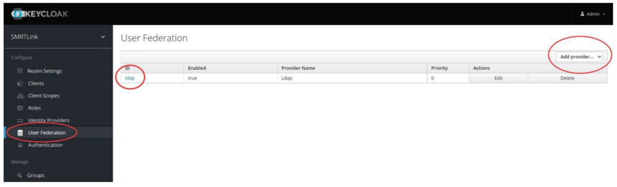
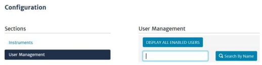
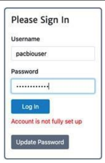
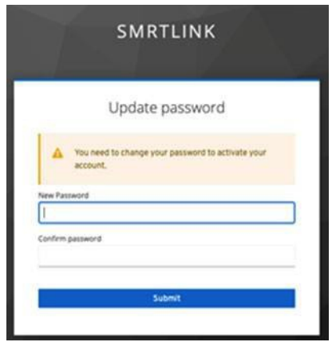
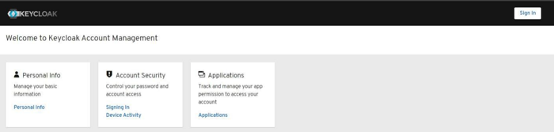

# Advanced Topics

This section delves into advanced configurations and optimizations for SMRT Link v{{smrt_link.version}}, enabling users to tailor the system to specific institutional needs and enhance performance.

---

## User management
SMRT Link utilizes Keycloak for user authentication and role management. Keycloak supports integration with LDAP for user login authentication, as well as using local Keycloak users that exist only within SMRT Link.

### SMRT Link user roles

SMRT Link supports three user roles: Admin, Lab Tech, and Bioinformatician. Roles define which SMRT Link modules a user can access.

??? abstract "Details"

    The following table lists the privileges associated with the three user roles:


    | **Tasks/Privileges**                         | **Admin** | **Lab Tech** | **Bioinformatician** |
    |---------------------------------------------|:---------:|:------------:|:--------------------:|
    | Add/delete SMRT Link users                  | ✅        | ❌           | ❌                   |
    | Assign roles to SMRT Link users             | ✅        | ❌           | ❌                   |
    | Update SMRT Link software                   | ✅        | ❌           | ❌                   |
    | Add/update instruments                      | ✅        | ❌           | ❌                   |
    | Access **Instruments** module               | ✅        | ✅           | ✅                   |
    | Access **Sample Setup** module              | ✅        | ✅           | ❌                   |
    | Access **Runs** module                      | ✅        | ✅           | ❌                   |
    | Access **Data Management** module           | ✅        | ✅           | ✅                   |
    | Access **SMRT Analysis** module             | ✅        | ✅           | ✅                   |

    - Assign at least one user per site to the Admin role. That individual is responsible for enabling and disabling SMRT Link users, as well as specifying their roles and adding/removing associated Revio instruments. The Admin can also access all SMRT Link modules, as well as every file in the system. (Note: SMRT Link supports multiple users with the Admin role per site.)
    - Assign users who work in the lab preparing samples and performing runs the Lab Tech role. Lab Tech can also access all SMRT Link modules.
    - Assign users who work only on data analysis the Bioinformatician role. Bioinformatician can only access the Instruments, Data Management and SMRT Analysis modules; this is the lowest access level.

    !!! note 
        The Admin role only allows a user account to administer the configuration options available through the SMRT Link browser UI. It does not provide access to the Keycloak management interface, which is intentionally restricted to the built-in admin user only.


### Enabling the Keycloak admin interface

The Keycloak Admin graphical interface is disabled by default for security reasons. Enable it on port 9443 using `--enable-keycloak-console`.

??? abstract "Details"

    1. **Enable Keycloak admin interface**:  and make it accessible on port 9443 by either:
        - Restart SMRT Link services with the `--enable-keycloak-console` flag. 
            ```bash
            $SMRT_ROOT/admin/bin/services-stop
            $SMRT_ROOT/admin/bin/services-start --enable-keycloak-console
            ```
        - Use the `restart-gui` command to toggle the admin interface while the server is running.
            ```bash
            $SMRT_ROOT/admin/bin/restart-gui --enable-keycloak-console
            $SMRT_ROOT/admin/bin/restart-gui --disable-keycloak-console
            ```
    2. **Access the Keycloak Admin Interface**: Open a web browser and navigate to
    ```
    https://<SMRT_Link_Server_Hostname>:9443/admin
    ```

    3. **Log In**:
    
    Use the administrator credentials (default: `admin/admin`) to log in.

    4. **Perform Administrative Tasks**:
    
    Manage users, roles, and authentication settings as required.

    5. **Disable the Keycloak Admin Interface**:
    
    For security purposes, disable the interface when not in use by restarting SMRT Link services without the `--enable-keycloak-console` flag:

    ```bash
    $SMRT_ROOT/admin/bin/services-start
    ```

    !!!note
        Ensure that access to port 9443 is restricted to authorized personnel only.


### Changing default passwords

It is recommended to change the default `admin` and `pbinstrument` passwords for enhanced security.

??? abstract "Details"

    The SMRT Link `admin` account has full access to SMRT Link, and is used to create users and grant users access. SMRT Link comes with a default Instrument Control Software (ICS) user account (`pbinstrument`) which is used by the instruments to communicate with SMRT Link web services over a secure, encrypted connection. 

    The `pbinstrument` account is required for instruments to communicate with SMRT Link (Note: the `pbinstrument` credentials can only be used to access SMRT Link resources – it is not an LDAP account or a local account on the Linux system).

    The passwords for the `admin` and `pbinstrument` accounts are set to default values that are the same for all SMRT Link installations. Because the passwords can be used to access SMRT Link accounts and information, the passwords **should be changed** and only given to trusted users who require access.

    To change the `admin` and `pbinstrument` passwords, you can either use the Keycloak Admin interface or the command line tools provided with SMRT Link.

    1. **Keycloak Admin Interface**: See [Adding Local Users](#adding-local-users) for instructions on changing passwords using Keycloak.

    2. **SMRT Link Command Line Tools**:

    To change the built-in account passwords for the new API gateway, use the following procedure while the server is running:
    ```
    $SMRT_ROOT/admin/bin/set-keycloak-creds --user admin --password ‘NEW-PASSWORD’ --admin --password ‘CURRENT-PASSWORD’
    ```
    ```
    $SMRT_ROOT/smrtcmds/developer/bin/pbservice-instrument set-smrtlink-password --user admin --ask-pass
    ```

    To verify the `admin` and `pbinstrument` passwords, use the following procedure:
    ```
    $SMRT_ROOT/smrtcmds/bin/pbservice status --host localhost --user admin --ask-pass
    ```
    ```
    $SMRT_ROOT/smrtcmds/bin/pbservice status --host localhost --user pbinstrument --ask-pass
    ```
    The `pbservice status` information should display, before exiting with an exit status of `0` indicating success.

    !!! note
        If the Keycloak Admin interface on HTTPS port `9443` is enabled, you can use it to change the `admin` password.


### LDAP integration

If you are interested in configuring SMRT Link integration with your organization’s LDAP, PacBio recommends that you consult your LDAP administrator to help determine the correct LDAP settings. 

??? abstract "Details"

    !!! note
        Existing LDAP configurations are automatically migrated during upgrade.

    **Configuring LDAP in Keycloak**
    - LDAP is configured after SMRT Link is installed, using the Keycloak authentication server software, as
    shown below.
    - SMRT Link must first synchronize with your organization's LDAP objects before any directory accounts can be enabled and given a role to facilitate SMRT Link access.

    1. Enter the following in your browser: `https://<hostname>:9443/admin/` – where <`hostname`> is the host where SMRT Link is installed ([the Keycloak console must be enabled](#enabling-the-keycloak-admin-interface)).
    2. Login using `admin`/`admin` (unless you have changed the password).
        - 
    3. Under **Configure** on the left-hand side of the window, click **User Federation**
        - 
    4. On the right-hand side of the window, click **Add provider…** and select the **ldap** option.
    5. Enter the required fields (and any others necessary for your LDAP server) and verify that you can connect to the server using the **Test connection** and **Test authentication** buttons.
        - 
        - The following fields are required (Note: Values provided in the example above are listed below for clarity. Actual values should be provided by your LDAP administrator):
            - Username LDAP attribute: `uid` (if you are using Active Directory, the most likely value is `sAMAccountName`)
            - RDN LDAP attribute: `uid` (usually the same as the Username LDAP Attribute)
            - UUID LDAP attribute: `entryUUID`
            - User Object Classes: `person, organizationalPerson, user`
            - Connection URL: `ldap://ldap.university:389`
            - Users DN: `CN=users,DC=university,DC=edu`
            - (Optional) Custom User LDAP Filter: (`objectClass=person`)
        - If Bind Type is simple, you also need to enter credentials for accessing the directory:
            - Bind DN: `CN=ldapadmin,CN=users,DC=university,DC=edu` (This is the user account that is used to authenticate to the LDAP environment.)
            - Bind Credential: <`password`>
    6. When you are finished click Save.
    7. After you save the LDAP configuration, additional buttons display at the bottom of the window. Clicking **Synchronize all users** imports all users to the Keycloak database without assigning them SMRT Link roles.
        - 
    8. Enable SMRT Link users individually as described in the next section
        - **Procedure**:
            - Access the Keycloak Admin interface.
            - Navigate to the "User Federation" section.
            - Add your LDAP/AD server details.
            - Configure synchronization settings.

    !!! note
        For more information on LDAP, consult the following web pages:
        - https://en.wikipedia.org/wiki/Lightweight_Directory_Access_Protocol
        - https://en.wikipedia.org/wiki/LDAP_Data_Interchange_Format
        - https://msdn.microsoft.com/en-us/library/ms677605%28v=vs.85%29.aspx
        
    Problems with the LDAP server may be debugged by looking at the log file located here:	

        ```bash
        $SMRT_ROOT/userdata/log/smrtlink-analysisservices-gui/keycloak.stdout
        ```
        
    !!! note
        If LDAPS needs to be used, the appropriate SSL certificate needs to be installed in a format understood by Keycloak. Use `keytool` to add the LDAPS X.509-formatted public certificate to a JKS file named `keycloak-truststore.jks`, set the passphrase to `password1`, and enter `yes` to force trust when prompted.
        
    To install the keystore, simply copy it to this location:
        ```
        $SMRT_ROOT/userdata/config/security/keycloak-truststore.jks
        ```

    Start the SMRT Link services, and in step 5 of the LDAP Integration instructions above, change the Connection
        URL to use an `ldaps:// URI` format, and, if necessary, adjust the port number. (Note: By default, LDAP uses TCP port `389` and LDAPS uses TCP port `636`)

    <br>

    **Adding SMRT Link users via LDAP integration and assigning user roles**

    - To enable users via LDAP integration, you must first configure LDAP before you can manage users and assign SMRT Link roles to users (see above). 
    - After LDAP is configured, if you do not assign a SMRT Link role to a user, that user will not be able to login to SMRT Link.

    1. Access **SMRT Link**: Enter `https://<hostname>:8243/sl/home`, where <`hostname`> is the host where SMRT Link is installed.
    2. Choose **Settings > User Management** at the top of the page.
    3. There are two ways to find users:
        - To display all SMRT Link users: Click **Display all Enabled Users**.
        - To find a specific user: Enter a user name, or partial name and click **Search By Name**
        - 
    4. Click the desired user. If the Status is **Enabled**, the user has access to SMRT Link; **Disabled** means the user **cannot** access SMRT Link.
        - To **add** a SMRT Link user: Click the **Enabled** button, then assign a role. (See Step 5.)
        - To **disable** a SMRT Link user: Click the **Disabled** button.
    5. Click the **Role** field and select one of the [three roles](#smrt-link-user-roles). (A blank role means that this user cannot access SMRT Link.)
    6. Click **Save Changes**. The user now has access to SMRT Link, based on the role just assigned.
        - 

### Single Sign-On (SSO) configuration
SMRT Link includes built-in support for SSO via SAML 2.0 identity providers (e.g., Okta, Auth0, Keycloak). 

To configure SSO, the following three steps must be completed sequentially:

1. Enable SMRT Link to use SSO  
2. Create a SMRT Link SSO application  
3. Configure Keycloak
    
**Prerequisites**

- A static, fully-qualified DNS name for your SMRT Link server (e.g., `smrtlink.university.edu`). Referred to as `{dnsName}` throughout this section.  
 - Ports **8243** and **9443** open to the local network on the SMRT Link server.  
- An alias for your provider (e.g., `okta`, `auth0`). Referred to as `{provider}` throughout this section.  

??? abstract "1. Enable SMRT Link to Use SSO"
    
    1. Stop SMRT Link services:  
    ```$SMRT_ROOT/admin/bin/services-stop```
    2. Configure the SMRT Link software to enable SSO login:
    ```$SMRT_ROOT/admin/bin/smrt_reconfig --batch --enable-sso true```
    3. Restart the server with the Keycloak admin console enabled:  
    ```$SMRT_ROOT/admin/bin/services-start --enable-keycloak-console```
   
    The following message will be printed in the console:  
    *Keycloak admin console is now available and listening on port 9443.*

    To disable SSO:
    ```$SMRT_ROOT/admin/bin/smrt_reconfig --batch --enable-sso false```

    For security, we recommended disabling the Keycloak console after use.
    
??? abstract "2. Create a SMRT Link SSO Application"    

    The LDAP/SSO IT administrator must create a new SAML 2.0 application for SMRT Link in accordance with your institution’s policies. The SAML configuration should reference the Keycloak endpoint URL on port 9443 and the SMRT Link application URL on port 8243.

    There are two basic steps to set up SMRT Link SSO in your SSO provider’s portal:

    1. Create a new application in your SSO provider’s portal.  
    2. Download the generated configuration metadata XML.  

    To configure a new application, you will minimally need:  
    - The SAML endpoint:
    ```https://{dnsName}:9443/realms/SMRTLink/broker/{provider}/endpoint```
    - The default application page for SMRT Link:  
    ```https://{dnsName}:8243/sl/instruments```
    
    Settings and fields may vary based on SSO provider and institutional policy. Following are select settings for Okta and Auth0 SSO providers. Depending on the network or security policies, the application may need to be explicitly enabled per-user.
        
    **Example settings for Okta**

    - Single Sign On URL: `https://{dnsName}:9443/realms/SMRTLink/broker/{provider}/endpoint`  
    - Recipient URL: `https://{dnsName}:9443/realms/SMRTLink/broker/{provider}/endpoint`  
    - Destination URL: `https://{dnsName}:9443/realms/SMRTLink/broker/{provider}/endpoint`  
    - Audience Restriction: `https://{dnsName}:9443/realms/SMRTLink/`  
    - Default Relay State: `https://{dnsName}:8243/sl/instruments` 
    
    **Example settings for Auth0**
    
    - Allowed Callback URL: `https://{dnsName}:9443/realms/SMRTLink/broker/{provider}/endpoint`
    - Addons: **SAML2** 
        - Addons Application Callback URL: `https://{dnsName}:9443/realms/SMRTLink/broker/{provider}/endpoint`
        - Addons SAML2 Settings (copy and edit):  
    ```
    {
      "audience": "https://{dnsName}:9443/realms/SMRTLink/broker/{provider}/endpoint",
      "mappings": {
        "email": "http://schemas.xmlsoap.org/ws/2005/05/identity/claims/emailaddress",
        "given_name": "http://schemas.xmlsoap.org/ws/2005/05/identity/claims/givenname",
        "family_name": "http://schemas.xmlsoap.org/ws/2005/05/identity/claims/surname"
      },
      "nameIdentifierFormat": "urn:oasis:names:tc:SAML:2.0:nameid-format:persistent"
    }
    ```
 
??? abstract "3. Configure Keycloak"

    The last step in setting up SSO for SMRT Link is configuring Keycloak. The bundled Keycloak server in SMRT Link is pre-configured with all settings required for SSO except for the identity provider itself, which is site-specific.

    Before getting started, ensure:

    - SSO has been enabled (see *Enable SMRT Link to Use SSO*).  
    - SAML metadata XML has been obtained (see *Create a SMRT Link Application*).  

    **Steps**

    1. If not enabled already, enable Keycloak:  
    ```$SMRT_ROOT/admin/bin/restart-gui --enable-keycloak-console```
    2. Login into the Keycloak Admin console at:  
    ```https://{dnsName}:9443/admin/```
    3. Click **Manage realms** on the left-hand menu, then select **SMRTLink**.  
    4. Click **Identity providers** on the left-hand menu and select **SAML 2.0**. If you already have a provider configured, the screen may differ.
    5. Change the **Alias** field to the configured value (e.g., `okta`).Optionally set the **Display name** (e.g., *PacBio Okta*).
    6. Set **Use entity descriptor** = Off and upload your metadata XML using **Import config from file**.
    7. Change **Want Assertions signed** to On. Save.
    8. In the updated configuration, set **First login flow override** = `SAML_login_flow`. Save again.
    9. Go to the **Mappers** tab, and create a new mapper:
        - Name: `add_role_mapper`
        - Type: **Hardcoded Role**
        - Role: `PbLabTech` (default lab tech role with access to all modules but not admin rights).
    10. Test by navigating to: `https://{dnsName}:8243/sl`.Confirm the SSO button is available and login is successful.  

### Adding local users

SMRT Link is designed to integrate with an LDAP server to provide user account information, but it is also possible to add local user accounts using the Keycloak server that handles authentication for the API gateway.

??? abstract "Details"

    **To add a local account:**
    
    1. Access the Keycloak Admin interface at `https://<servername>:9443/admin` and log in with
    the SMRT Link built-in `admin` account credentials (`admin`/`admin` by default.)
    2. On the left-hand menu, under **Manage**, click **Users**.
    3. Click the **Add user** button on the right-hand side of the screen.
        - 
    4. Complete the form and click **Save**.
        - 
    5. In the newly added user page, click **Credentials**, and enter a password for the user. If you are issuing a temporary password that the user needs to change on first login, make sure the **Temporary** toggle is **ON**. The section below covers password changes.
        - 

    **To change a temporary password**:

    1. When a new local user attempts to log in to SMRT Link with a temporary password, the login will fail with the message “Account is not fully set up”, and a button displays to open the Keycloak user console.
        - 
    2. Log in to Keycloak with the same credentials. The Keycloak Admin interface will prompt the user to enter a new password.
        - 
    3. Once the password has been changed, return to the SMRT Link login screen and enter the new password.
    4. Local users may change their passwords again by navigating directly to the Keycloak user account page at `https://<hostname>:9443/auth/realms/SMRTLink/account/#/`
        - 
	

##  SSL/TLS

SMRT Link uses SSL (Secure Sockets Layer) to enable access via HTTPS (HTTP over SSL), so that your SMRT Link logins and data are encrypted during transport to and from SMRT Link. SMRT Link includes an authentication server (Keycloak), which can be configured to integrate with your LDAP/AD servers and enable user authentication using your organizations’ user name and password. To ensure a secure connection between the SMRT Link server and your browser, a domain-specific SSL certificate may be installed after completing SMRT Link installation.

??? abstract "Details"

    It is important to note that PacBio will not provide a CA-signed SSL certificate. However, once your site has obtained a CA-signed SSL certificate, PacBio’s tools can be used to install it for use with SMRT Link web services. (Note: PacBio recommends that you consult your IT administrator about obtaining an SSL certificate.) You will need a certificate issued by a certificate authority (CA). PacBio has tested SMRT Link with certificates from the following certificate vendors: VeriSign, Thawte and DigiCert.

    If your site does not provide an SSL certificate, SMRT Link will use a PacBio self-signed SSL certificate. If you use the self-signed SSL certificate, each user will need to accept the browser warnings related to access in an insecure environment. You can also have your IT administrator configure desktops to always trust the provided self-signed certificate. Note that SMRT Link is installed within your organization’s secure network, behind your organization’s firewall.

    See “Using SMRT Link with a PacBio self-signed SSL certificate” for details on how to handle the security warnings when accessing SMRT Link.

    Use the following procedures only if your site provides an SSL certificate. These procedures are not applicable if you are using PacBio’s self-signed SSL certificate.

    **Installing an SSL certificate for NGINX**

    In the new API gateway, SSL transport is handled by the NGINX web server, which uses a simpler configuration consisting of a plain-text certificate and private key. By default, SMRT Link will generate a selfsigned certificate and key the first time you start the new API gateway:

    ```
    $SMRT_ROOT/userdata/config/security/pb-smrtlink-default.crt
    $SMRT_ROOT/userdata/config/security/pb-smrtlink-default.key
    ```

    **To install a custom certificate for NGINX**

    1. Stop SMRT Link services:
    ```
    $SMRT_ROOT/admin/bin/services-stop
    ```
    2. Copy the certificate and private key files to these paths:
    ```
    $SMRT_ROOT/userdata/config/security/smrtlink-site.crt
    $SMRT_ROOT/userdata/config/security/smrtlink-site.key
    ```
    3. Start SMRT Link services:
    ```
    $SMRT_ROOT/admin/bin/services-start
    ```

    **Restoring the default self-signed SSL certificate**

    It may sometimes be necessary to uninstall the user-provided SSL certificate and restore the default certificate. This requires the following steps.
    ```
    $SMRT_ROOT/admin/bin/services-stop
    #remove or rename site certificates
    $SMRT_ROOT/admin/bin/services-start
    ```

    **Using SMRT Link with a PacBio self-signed SSL certificate**

    SMRT Link uses self-signed SSL certificate generated by the installer. If your site does not have a signed SSL certificate and you use the self-signed SSL certificate, each user will need to accept the browser warnings related to access in an insecure environment. You can also have your IT administrator configure desktops to always trust the provided self-signed certificate. Note that SMRT Link should be installed within your organization’s secure network, behind your organization’s firewall.
    Security messages display when users try to login to SMRT Link for the first time using the Chrome browser. These messages may also display other times when accessing SMRT Link. Each SMRT Link user in your organization should address these browser warnings following the procedure below.

    1. The first time you start SMRT Link after installation, you see the following text. Click the **Advanced** link.
        - 
    2. Click the **Proceed**... link. (You may need to scroll down.)
        - 
    3. Close the window by clicking the **Close** box in the corner.
    4. The **Login** dialog displays, where you enter the User Name and Password. The next time you access SMRT Link, the Login dialog displays **directly**.


## API documentation

??? abstract "Details"

    Detailed API documentation is available at on SMRT Link's Swagger UI, which provides an interactive interface for exploring and testing the API endpoints:

    ```
    https://<SMRT_Link_Server_Hostname>:8243/sl/docs/services/#/default
    ```

    **Authentication**:

    API access requires authentication tokens obtained via the Keycloak authentication service.

    **Integration Steps**:

    1. **Obtain API Credentials**:

    Create a client in Keycloak for API access and obtain client credentials.

    2. **Authenticate**:

    Use the client credentials to obtain an access token:

    ```bash
    curl -X POST "https://<SMRT_Link_Server_Hostname>:8243/auth/realms/SMRTLink/protocol/openid-connect/token"    -H "Content-Type: application/x-www-form-urlencoded"    -d "grant_type=client_credentials&client_id=<client_id>&client_secret=<client_secret>"
    ```

    3. **Access API Endpoints**:

    Include the access token in the `Authorization` header for API requests:

    ```bash
    curl -X GET "https://<SMRT_Link_Server_Hostname>:8243/runs"    -H "Authorization: Bearer <access_token>"
    ```


## LIMS integration

??? abstract "Details"

    Integrating SMRT Link with a Laboratory Information Management Systems (LIMS) streamlines data management and enhances laboratory workflows.

    **SMRT Link API**

    SMRT Link provides a RESTful API for integration with external systems.

    **Key Endpoints**:

    - **Run Management**:

    Create, monitor, and manage sequencing runs.

    - **Sample Management**:

    Add, update, and retrieve sample information.

    - **Analysis Management**:

    Initiate and monitor secondary analyses.


## Database backups

SMRT Link does not perform periodic database backups. It is recommended to schedule regular backups of the SMRT Link database to minimize risks of losing records. However, note that the underlying sequencing or analysis files, such as BAM files, are not affected.

??? abstract "Details"

    A database backup is still automatically performed once, during installation or upgrade. Failure to back up the SMRT Link database on a regular schedule risks losing all records in SMRT Link (including users, Data Sets, analyses, barcodes, and references) if a file system or reconfiguration error occurs. 

    We strongly recommend asking your local Linux system administrator to schedule regular weekly backups of the SMRT Link database using standard Linux utilities. A utility script to generate an appropriate cron server command was added at `$SMRT_ROOT/admin/bin/generate-cron-backup`. 

    This script runs the `$SMRT_ROOT/admin/bin/dbhelper --backup` command to backup the SMRT Link database at 2AM every night. 

    For additional details, please contact PacBio Technical Support.


## Sending log files to PacBio Technical Support

Troubleshooting information can be sent to PacBio Technical Support multiple ways. 

??? abstract "Details"

    If there is a connection to the [PacBio Event Server](system-requirements.md#smrt-link-related-ports), do the following:

    - From the SMRT Link menu: Settings > About > Troubleshooting Information > Send.
    - From a SMRT Link “Failed” analysis results page: Click **Send Log Files**.

    If there is connectivity to the PacBio Event Server, run the following command to generate the information and automatically send it to PacBio Technical Support:

    ```
    $SMRT_ROOT/admin/bin/tsreport-install --bundle --upload
    ```

    If there is no connectivity to the PacBio Event Server, run the following command to generate a .tgz file and email the file to `support@pacb.com` to file a case:

    ```
    $SMRT_ROOT/admin/bin/tsreport-install --bundle
    ```

    The generated file can be found here: `$SMRT_ROOT/userdata/tsreport/data/ts-install.tgz`.

    Note: The SMRT Link logs archive bundle will be limited to logs from approximately the past 24 hours. Ensure
    the above tsreport-install options and SMRT Link menu's Send button are run within one day of
    experiencing the issue being addressed.


## Changing usage tracking settings

When first logging in to the SMRT Link GUI after a successful installation or upgrade, users are prompted to notify PacBio of the upgrade/installation success and whether they wish to share SMRT Link analysis usage information with PacBio. We recommend accepting these conditions to better enable remote troubleshooting by PacBio support personnel. 

Once set, these settings may only be viewed and modified from the command line using the `accept-user-agreement` tool.

??? abstract "Details"

    !!! warning
        To use the accept-user-agreement tool, services must be running:
        ```
        $SMRT_ROOT/admin/bin/services-start
        ```

    To set new settings, use the following command, specifying true or false for the options accordingly. For example:
    ```
    $SMRT_ROOT/admin/bin/accept-user-agreement --install-metrics true --job-metrics true
    ```

    PacBio is notified of a successful installation or upgrade **immediately** if the install metrics setting is true. To view the current settings, run the command without any arguments:
    ```
    $SMRT_ROOT/admin/bin/accept-user-agreement
    ```

    !!! note
        If accept-user-agreement is run without arguments and the settings have not been previously set (either in the GUI or on the command line), both the install and job metrics settings will automatically be set to true and PacBio will be immediately notified of the installation or upgrade.


## Starting SMRT Link automatically on server boot

To start SMRT Link automatically when the server boots using systemd, refer to the template service file. 

??? abstract "Details"

    File located here:
    
    ```bash
    $SMRT_ROOT/admin/template/smrtlink.service.tmpl
    ```

    Follow the instructions in the template comments to make site-specific modifications and install as a system service unit.
