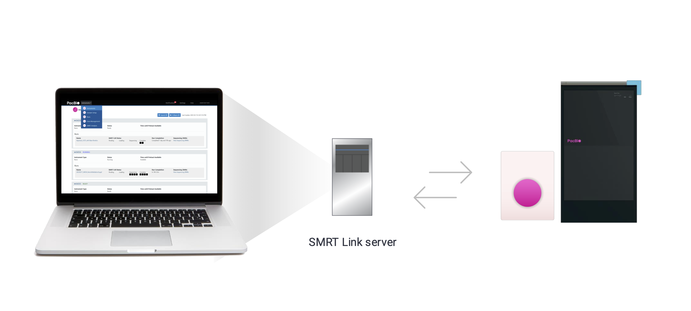

This site describes the procedure for installing SMRT Link v{{ smrt_link.version }} or SMRT Link Lite v{{ smrt_link_lite.version }}. This site is for Customer IT or SMRT Link administrators.

!!! note
    SMRT Link v{{ smrt_link.version }} and SMRT Link Lite v{{ smrt_link.version }} support Vega™ and Revio® systems. Sequel® II systems, Sequel IIe systems, and Sequel systems are not supported.

## What is SMRT Link?
SMRT Link is a web-based end-to-end workflow manager. 

SMRT Link is free PacBio-provided software **required** for instrument management, sequencing run setup/monitoring, and viewing performance metrics. SMRT Link can also *optionally* be configured to run select analysis workflows – depending on compute resources available – by interfacing with existing job management systems (e.g., SLURM).

In essence, SMRT Link software is a web service hosted on a dedicated Linux server, virtual machine (VM), or by PacBio in the cloud – providing a convenient graphical user interface for interacting with PacBio instruments and analysis workflows and can be accessed from any computer on the same network via a web browser.



Visit [System Requirements](system-requirements.md) for more information on the prerequisites for installing SMRT Link including hardware (e.g., CPU, RAM, disk space), software (e.g., operating system), and network configurations.

## SMRT Link modules


## SMRT Link options
SMRT Link is available for both local installation and cloud access, offering flexibility to work in different environments depending on your lab's needs. This guide will only cover the installation of SMRT Link and SMRT Link Lite, but it is worth noting that PacBio also offers a cloud-based solution for SMRT Link.

- **SMRT Link**: A fully-featured on-prem solution
	- Provides all the features of SMRT Link including push-button secondary analysis capabilities (SMRT Analysis)
- **SMRT Link Lite**: An is an on-prem solution with minimal hardware requirements
	- Ideal if there are network restrictions preventing cloud use
	- No push-button secondary analysis
- **SMRT Link Cloud**: A fully managed cloud solution
	- Provided and hosted by PacBio (free)
	- Enables quick setup for running the instrument
	- No push-button secondary analysis
- **SMRT Tools**: SMRT Tools are the command-line tools included with SMRT Link. These are developer tools for use by bioinformaticians working with secondary analysis results.

| **SMRT Link features**                                     | **SMRT Link**                              | **SMRT Link Lite**                          | **SMRT Link Cloud**      |
|------------------------------------------------------------|--------------------------------------------|---------------------------------------------|--------------------------|
| **Supported instruments¹**                                 | Revio®, Vega™, and Sequel® IIe             | Revio, Vega, and Sequel IIe                 | Revio and Vega           |
| **Instrument monitoring**                                  | ✅                                          | ✅                                           | ✅                        |
| **Sample setup**                                           | ✅                                          | ✅                                           | ✅                        |
| **Run design**                                             | ✅                                          | ✅                                           | ✅                        |
| **Run monitoring/QC**                                      | ✅                                          | ✅                                           | ✅                        |
| **Push-button secondary analysis (SMRT® Analysis)**        | ✅                                          | ❌                                           | ❌                        |
| **3rd party and PacBio Compatible Partners analysis**      | ✅                                          | ✅                                           | ✅                        |
| **API access**                                             | ✅                                          | ✅                                           | ❌                        |

For more information, visit our [SMRT Link Application Brief](https://www.pacb.com/wp-content/uploads/Application-brief-SMRT-Link.pdf).

## Latest version

Version **{{ smrt_link.version }}**: [Release Notes](https://www.pacb.com/wp-content/uploads/SMRT-Link-Release-Notes-v{{smrt_link.version}}.pdf)

The latest version of SMRT Link can be downloaded from [PacBio's Software Downloads page](https://www.pacb.com/support/software-downloads/).

```bash
curl -O https://downloads.pacbcloud.com/public/software/installers/smrtlink-release_25.2.0.266456.zip
```

## What's new

Below are a few high-level updates to version {{ smrt_link.version }}. For the full set of updates, please see the [release notes](https://www.pacb.com/wp-content/uploads/SMRT-Link-Release-Notes-v{{smrt_link.version}}.pdf):

- Support for Vega instrument software v1.1.0.
- New PureTarget custom run design application
- Updated PureTarget repeat expansion and Target Enrichment SMRT Analysis workflows.

## Getting started
Visit [Quick Start Guide](quick-start-guide.md) or check out our SMRT Link Install tutorial video!

<div style="text-align: center;">
  <a href="https://youtu.be/5vL_EXNbdrY" target="_blank">
    
  </a>
</div>