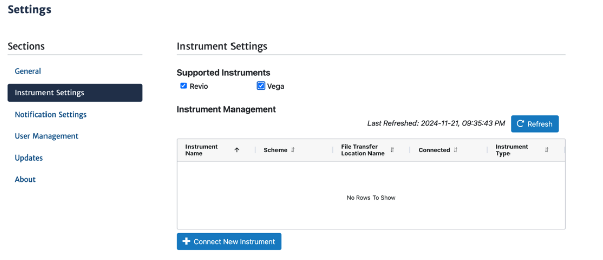
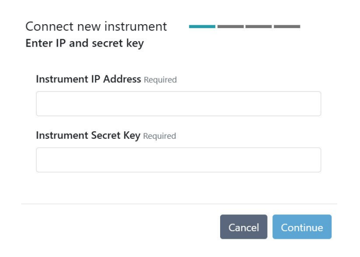
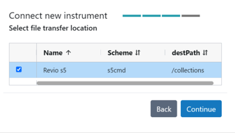

# Instrument connection

This section provides guidance on connecting an instrument (Revio or Vega system) to SMRT Link v{{smrt_link.version}} to enable users to start sequencing runs and ensure seamless data transfer following sequence completion and importation into SMRT Link to view run metrics. 

The following procedure is available only for SMRT Link users whose role is `Admin`.


## Storage considerations 

If not done already, identify a location in the cloud or on your shared file system (NFS) where the instrument can transfer data. This location must be readable from the SMRT Link server. 

| Instrument   | Storage Requirements | 
|--------------|----------------------|
| Revio system | Up to 78 TB/year <br> Assuming 120 Gbp HiFi Yield (~60 GB file size) per SMRT Cell and 1,300 SMRT Cells per year. |
| Vega system  | Up to 6 TB/year <br> Assuming ~60 Gbp HiFi yield (~30 GB file size) per SMRT Cell and 200 SMRT Cells per year.   |

- This location can be located on the same share as [`jobs_root`](system-requirements.md#associated-install-directories), but should be considered separately with regard to storage needs.
- Job storage requirements depend on utilization and analyses performed.

## Setting up a file transfer scheme/location

| Step | Action                                                                                 |
|------|----------------------------------------------------------------------------------------|
| 1    | Identify the location on you SMRT Link or file share (NFS) where data should transfer  |
| 2    | In SMRT Link web interface, navigate to `Settings > Instrument Settings`               |
| 3    | Click `+ New File Transfer Location`                                                   |
| 4    | Choose the desired scheme: <ul><li> ssh (srs) </li><li> Amazon S3 </li><li> Google Cloud Storage </li><li> Microsoft Azure Blob Storage </li><li> S3-compatible storage </li></ul> |
| 5    | Enter the required information for the selected transfer scheme. <ul><li> **Name**: User-specified text string that displays in the Data directory dialog to identify the transfer scheme. </li><li> **Description**: User-specified text string that describes the transfer scheme. </li><li> **Scheme-specific fields** (see below). </li></ul> | 
| 6    | Click `Save`                                                                           |
| 7    | Once the transfer scheme is associated with a connected instrument (see [Connect a New Instrument](#connect-a-new-instrument)), return to this menu and click `Test Settings` to ensure that the scheme works. |

!!! warning
    The rsync daemon file transfer scheme will be disabled through a future software update in favor of more secure alternatives. Once disabled, file transfers will fail. PacBio strongly recommends transitioning to a supported transfer option.

### Scheme-specific fields

#### SSH (srs)

??? abstract "Expand scheme details"

    !!! note
        If you are using the SSH (srs) scheme, contact your Field Service Engineer (FSE) or PacBio tech support to have an SSH key created on your instrument. You will recieve the public SSH key which should be placed in `~/.ssh/authorized_keys` file on the transfer server for whatever user is recieving the transfer (typically `$SMRT_USER`; Username setting below)

    Please ensure that the `~/.ssh` folder and `~/.ssh/authorized_keys` file have the correct permissions set to allow the instrument to transfer data. 

    ```
    chmod 700 ~/.ssh
    chmod 600 ~/.ssh/authorized_keys
    ```

    - **Host**: DNS name or IP address of your storage server. This may be the SMRT Link server or another storage location on the network. The name of this system can be obtained from your system administrator. Example: mp-srs.
    - **Destination path**: File system location that contains all data transferred via srs.
    - (Optional) **Relative path**: Path used to place run data in a specific sub- directory underneath the location specified in Destination path, on a per-instrument basis. A common value for this field is the instrument serial number or name. This field can contain only alphanumerics, “-“, “_”, and “/”. This field allows separation of run data from different instruments, which allows for easier location of particular run data when browsing the file system.
    - **Username**: Name of the service account used for transferring datasets to the remote file server.
    - **SSH Key**: Full path to the SSH private key on the instrument. Please contact your FSE or PacBio tech support to recieve this path. 


#### Amazon S3

??? abstract "Expand scheme details"

    - **Bucket**: Bucket name without the “s3://” prefix. Example: mp-s3
    - **Region**: Region where the bucket is hosted. To find your region run:
    ```bash
    curl --silent --head https://s3.amazonaws.com/<your-bucket> | grep 'x-amz-bucket-region'
    ```
    - **Path** (Optional): Path used to place run data in a specific sub- directory within the specified bucket. This field can contain only alphanumerics, “-“, “_”, and “/”. This field allows separation of run data from different instruments, which allows for easier location of particular run data when browsing the file system.
    - **Access key ID**
    - **Secret access key**

    **S3 Bucket configuration** 

    1. Create a private S3 bucket, e.g. `mylabname-pacbio-instrument-data` in your preferred geographical region.
    2. Create an IAM policy pacbio-instrument-file-transfer granting the necessary permissions
    on the bucket, including the ability to read, write, and delete objects.
    3. Create an IAM user with the new policy attached.
    4. Create static access credentials for the new IAM user and save them for step 5.
    5. Log in to SMRT Link as an admin user, navigate to Instrument Settings, and create a new
    Amazon S3 transfer scheme with the bucket name and region from step 1, and access
    credentials from step 4.
    Example IAM policy, where `$BUCKET` is replaced by the actual destination bucket name
    (e.g. `mylabname-pacbio-instrument-data`).
    ```
    {
      "Version": "2012-10-17",
      "Statement": [
        {
          "Sid": "VisualEditor0",
          "Effect": "Allow",
          "Action": [
            "s3:PutObject",
            "s3:GetObject",
            "s3:GetBucketWebsite",
            "s3:GetObjectVersionTagging",
            "s3:ListBucketVersions",
            "s3:GetObjectAttributes",
            "s3:GetObjectTagging",
            "s3:ListBucket",
            "s3:GetBucketVersioning",
            "s3:GetObjectVersionAttributes",
            "s3:GetObjectVersion",
            "s3:DeleteObject"
          ],
          "Resource": [
            "arn:aws:s3:::$BUCKET",
            "arn:aws:s3:::$BUCKET/*"
          ]
        }
      ]
    }
    ```


#### Google Cloud Storage

??? abstract "Expand scheme details"

    - **Bucket**: Bucket name with no “gs://” prefix
    - **Path**: /path/to/subfolder in bucket to which to post
    - **Access key**: Create HMAC key in GCP console (see
    <https://cloud.google.com/storage/docs/authentication/managing-hmackeys#console>)
    - **Secret key**: Create HMAC key in GCP console (see
    <https://cloud.google.com/storage/docs/authentication/managing-hmackeys#console>)


#### Microsoft Azure Blob Storage

??? abstract "Expand scheme details"

    - **Account name**: Account name, for example <account-name> from https://<accountname>.blob.core.windows.net
    - **Container**: The container name from https://<accountname>.blob.core.windows.net/<container>
    - **Path**: /path/to/subfolder in container
    - **Account key**: Key associated with account


#### S3-compatible storage

??? abstract "Expand scheme details"

    !!!note
        Follow [Amazon S3 Bucket configuration](#amazon-s3) requirements when setting up S3 compatible storage.

    - **Endpoint**: URL for object storage endpoint, for example https://storage.googleapi.com
    - **Bucket**: Bucket name with no prefix, for example /bucketname .
    - **Region** (Optional): Region name for cloud-based services.
    - **Path** (Optional): Path used to place run data in a specific sub- directory underneath the location specified by your Bucket, on a per-instrument basis. A common value for this field is the instrument serial number or name. This field can contain only alphanumerics, “-“, “_”, and “/”. This field allows separation of run data from different instruments, which allows for easier location of particular run data when browsing the file system.
    - **Access key**: Access key for cloud-based services.
    - **Secret key**: Secret key for cloud-based services


## Connect a new instrument

!!! note
    The following procedure is available only for SMRT Link users whose role is `Admin`.

| Step | Action                                                                                 |
|------|----------------------------------------------------------------------------------------|
| 1    | In SMRT Link web interface, navigate to `Settings > Instrument Settings`               |
| 2    | Click `+ Connect New Instrument. `                                                     |
|      |                                                   |
| 3    | Enter the IP address of the new Revio or Vega system. This is available on the instrument touchscreen; please write it down for later reference.                                          |
| 4    | Enter the Instrument Secret Key. This is available on the instrument touchscreen, please write it down for later reference. Then, click `Continue`.                                      |
|      |                                                   |
| 5    | Enter the name of the new instrument, then click `Continue`. <br> Note: The name must contain only alphanumeric characters, spaces, hyphens (-), underscores (_), or apostrophes ('). In addition, the instrument name must be unique for a given SMRT Link installation. Recommend using the instrument serial number (Revio: 84###; Vega: 21###)                                        |
|      |                                                   |
| 6    | Select a File Transfer Location. See [Setting up a File Transfer Scheme/Location](#setting-up-a-file-transfer-schemelocation).                                                   |
|      |                                                   |
| 7    | Click `Continue`                                                                       |
| 7    | Verify the information, click `Confirm`, and then `Close`. The new instrument displays in the `Instrument Management` table as well as in the `Instruments` module                        |


## Modifying an existing instrument connection

!!! note
    The following procedure is available only for SMRT Link users whose role is `Admin`.

| Step | Action                                                                                 |
|------|----------------------------------------------------------------------------------------|
| 1    | In SMRT Link web interface, navigate to `Settings > Instrument Settings`               |
| 2    | In the Instrument Management table, click an existing instrument. The Edit Instrument dialog displays                                                                                 |
| 3    | (Optional) Edit the instrument name. Note: The name must contain only alphanumeric characters, spaces, hyphens (-), underscores (_), or apostrophes (').                           |
| 4    | (Optional) Select a different File Transfer Location. Note: If a run is currently in progress, the file transfer location will be updated after the run is completed.                |
| 5    | Click Apply                                                                            |