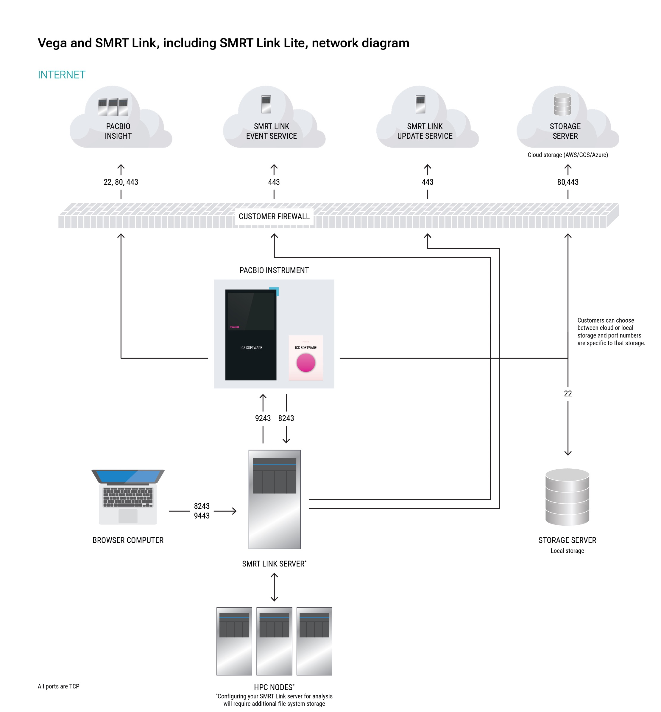

# System Requirements

## Supported systems

| Instrument                    | Instrument software                                           |
|-------------------------------|---------------------------------------------------------------|
| **Revio® system**             | Instrument software v13.3, all chemistries                    |
| **Vega™ system**              | Instrument software v1.1.0, all chemistries                   |


**Sequel® II systems, Sequel IIe systems, and Sequel systems are not supported.**

## Operating Systems

| Supported Distributions | Specification | 
|-------------------------|---------------|
| Rocky Linux             | 9 & 10        |
| Ubuntu                  | 22.04 & 24.04 |

!!!warning
    - SMRT Link is not guaranteed to work on operating system versions that are no longer supported by their vendors.
    - SMRT Link server software cannot be installed on Mac OS or Windows systems.

## Hardware configuration

There are three hardware configuration options for on-prem SMRT Link installation:

1. SMRT Link (multi-node)
2. SMRT Link (single-node)
3. SMRT Link Lite

Which configuration option to choose depends on your available compute resources and if you need SMRT Analysis (push-button secondary analysis). 

| Configuration Option         | CPU      | RAM                | Local Storage     | Use Cases                     |
|------------------------------|----------|--------------------|-------------------|-------------------------------|
| **SMRT Link<br>multi-node**  |          |                    |                   | Full SMRT Analysis support    |
| *Head Node*                  | 8 cores  | 32 GB              | 500 GB SSD        |                               |
| *Compute Node(s)*            | 64 cores | 4 GB/core (256 GB) | 100 GB SSD or HDD |                               |
|                              |          |                    |                   |                               |
| **SMRT Link<br>single-node** | 16 cores | 64 GB              | 1 TB SSD          | Limited SMRT Analysis support |
|                              |          |                    |                   |                               |
| **SMRT Link Lite**           | 4 cores  | 16 GB              | 50 GB SSD         | No SMRT Analysis              |

### SMRT Link Lite
SMRT Link Lite is optimized for non-server hardware by disabling compute-intensive components.

### SMRT Link (single node)
In the SMRT Link single-node configuration, certain workflows may be unsupported or limited by the maximum input file size for a single-node system. Below is a list of recommended input size limits for datasets when performing analysis with a single-node configuration. 

Additionally, it is recommended to adjust the `concurrent-job-limit` in Step 9 of the [SMRT Link installation process](installing-smrt-link.md#installation-steps) or manually edit the `$SMRT_ROOT/userdata/generated/config/cromwell.conf` file to ensure that the number of concurrently running jobs does not exceed the available memory on your single-node system. 

| Workflow                       | Limit                                |
|--------------------------------|--------------------------------------|
| HiFi Mapping                   | 150 Gb                               |
| Read Segmentation              | no limit                             |
| Iso-Seq Analysis               | 20 M reads                           |
| Single cell Iso-Seq Analysis   | 60 M reads                           |
| Target Enrichment              | no limit but disable variant calling |
| PureTarget repeat expansion    | no limit                             |
| Variant Calling                | not supported                        |
| Microbial Genome Analysis      | no limit                             |


## Software Dependencies

- SMRT Link server should run on a dedicated 64-bit Linux host with `libc 2.17` or greater.
- SMRT Link requires the Google Chrome web browser.
- SMRT Link requires a minimum screen resolution of 1600 by 900 pixels.

If you are installing a full SMRT Link instance and want to use SMRT Analysis to run push-button analyses there are additional software requirements. 

**Job Management System (JMS)**

Configuring SMRT Link with a Job Management System (JMS) is required for SMRT Analysis. Using unsupported JMS may require additional user provided configuration.

- SLURM (supported)
- LSF
- PBS

**Singularity**

Singularity v3.10.5 or later is required for the Variant Calling and Target Enrichment analysis workflows. Apptainer may be used as a drop-in replacement for Singularity.

- We recommend installing the Singularity through the package manager (e.g., `apt`, `yum`), with the setuid bit enabled (`chmod u+s singularity`) in the `/bin` or `/usr/bin` directory. The singularity binary should then have `-rwsrxr-x` permissions.
- Because a SMRT Link server running SMRT Analysis should be configured to run with SLURM, we recommend installing the [`singularity-ce`](https://github.com/sylabs/singularity/releases) package on the SMRT Link server, as well as each of the nodes within the relevant partition where you are submitting jobs.
- Singularity should *not* be installed in an NFS area of the file system.
- The singularity binary cannot be installed to any file system area mounted with the `nosuid` and/or `noexec` mount options.
- To run Variant Calling or Target Enrichment, Singularity requires the following Docker images:
	- `docker://google/deepvariant:1.6.1`
	- `docker://google/deepvariant:1.6.1-gpu`
	- `docker://quay.io/biocontainers/whatshap:1.4--py39hc16433a_1`
	- `docker://ghcr.io/dnanexus-rnd/glnexus:v1.4.1`


To save these images locally, we provide a script, `$SMRT_ROOT/admin/bin/fetch-singularity-cache`, which uses the root account to download the images, using `/tmp` as a temporary file space, before depositing the `.sif` files into `$SMRT_ROOT/userdata/singularity` and changing ownership to the requesting user. We recommend running this script after installing SMRT Link.


!!! note
    **DeepVariant 1.9.0** is the newest model and trained on SPRQ sequencing chemistry. It is not yet available for use with SMRT Link but is available in our GitHub [PacBio WGS Variant (WDL) Pipeline](https://github.com/PacificBiosciences/HiFi-human-WGS-WDL) (for advanced users).

## Server environment

### Definitions and variables
- `$SMRT_USER`: Dedicated service account to install and run SMRT Link
	- Recommend username: `smrtanalysis`
- `$SMRT_ROOT`: The SMRT Link installation root directory
	- Recommended install location: `/opt/pacbio/smrtlink`
- `smrtlinkhost.mydomain.com`: The fully-qualified domain name of the SMRT Link Install Host.
- `smrtlinkhost`: The short host name of the SMRT Link Install Host.

We recommend setting `SMRT_USER` and `SMRT_ROOT` in your shell profile to avoid having to type them repeatedly.

```bash
export SMRT_USER=smrtanalysis
export SMRT_ROOT=/opt/pacbio/smrtlink
```

!!!note 
	- The base directory `/opt/pacbio/` should be created prior to installation and owned by `$SMRT_USER` with read/write/execute permissions.
	- The `smrtlink/` directory should not exist prior to installation as it **will be created during installation**
	- `db_datadir`, `jobs_root`, and `tmp_dir` can be modified during installation or using `$SMRT_ROOT/admin/bin/smrt_reconfig` scripts. 

!!!warning
	Do **not** install SMRT Link as the root user!

### Associated install directories

| Directory name | Description                                                                                                                                                                               | Default                                  | Permissions          | Servers requiring access via the same PATH   |
|----------------|-------------------------------------------------------------------------------------------------------------------------------------------------------------------------------------------|------------------------------------------|----------------------|----------------------------------------------|
| `$SMRT_ROOT`   | SMRT Link installation directory                                                                                                                                                          | `/opt/pacbio/smrtlink`                   | rwx for `$SMRT_USER` | SMRT Link server and all compute nodes (NFS) |
| `db_datadir`   | SMRT Analysis database directory <br> During installation, a symbolic link is set from `$SMRT_ROOT/userdata/db_datadir` to the desired location.                                          | `$SMRT_ROOT/userdata/db_datadir.default` | rwx for **only** `$SMRT_USER` | SMRT Link server only (not NFS)              |
| `jobs_root`    | SMRT Analysis workflow output/results directory <br> During installation a symbolic link is set from `$SMRT_ROOT/userdata/jobs_root` to the desired location.                             | `$SMRT_ROOT/userdata/jobs_root.default`  | rwx for `$SMRT_USER` | SMRT Link server and all compute nodes (NFS) |
| `tmp_dir`      | SMRT Analysis temporary directory used for fast I/O operations <br> During installation a symbolic link is set in `$SMRT_ROOT/userdata/tmp_dir` to the desired location for this database | `/tmp/smrtlink`                          | rwx for `$SMRT_USER` | SMRT Link server only (not NFS)              |


!!!note
	**Storage Considerations**: Job storage requirements depend on utilization and analyses performed. `jobs_root` is unrelated to storage requirements related to instrument data transfer.
	
	- For the Revio system: Up to 78 TB/year, assuming ~60 GB of HiFi data per SMRT Cell and 1,300 SMRT Cells per year.
	- For the Vega system: Up to 6 TB/year, assuming ~30 GB of HiFi data per SMRT Cell and 200 SMRT Cells per year.

### Other environment considerations

- No other daemons/services processes are bound to the same ports as the SMRT Link services. Ideally, the SMRT Link server should be dedicated to only running SMRT Link services.
- PacBio highly recommends that the system clock be synchronized to a domain or public NTP time server.
- The `$SMRT_USER` service account must have both the `nofile` and `nproc` soft user limits set to a minimum of `8192`. (See the [ulimit](https://docs.oracle.com/cd/E19683-01/816-0210/6m6nb7mo3/index.html) and [limits.conf](https://man.archlinux.org/man/limits.conf.5) Linux man pages for more information).
- The host operating system must provide the `en_US.UTF-8` locale/character set.
- SMRT Link and SMRT Link Lite are not designed to handle changes in the hostname. If you are using them to connect to a Revio or Vega instrument you should ensure that the configured hostname is and will remain accessible across the network.

---


## Network Configuration

**Firewall Settings**: Ensure ports are open and not blocked by firewalls. No other daemons/services processes can be bound to the same ports as the SMRT Link services.

### SMRT Link related ports
| Source             | Destination                                                           | Port     | Description                                                                                                                             |
|--------------------|-----------------------------------------------------------------------|----------|-----------------------------------------------------------------------------------------------------------------------------------------|
| Customer laptop/PC | SMRT Link Server                                                      | 8243/tcp | SMRT Link web services and GUI https and communication from instrument                                                                  |
| Customer laptop/PC | SMRT Link Server                                                      | 9443/tcp | SMRT Link administration <br> Disabled by default in SMRT Link services <br> Must be manually enabled using `--enable-keycloak-console` |
| Revio/Vega system  | SMRT Link Server                                                      | 8243/tcp | Communication from instrument to SMRT Link                                                                                              |
| SMRT Link Server   | Revio/Vega system                                                     | 9243/tcp | Communication from SMRT Link to instrument                                                                                              |
| SMRT Link Server   | PacBio Event server <br> (https://smrtlink-eve.pacbcloud.com)    | 443/tcp  | Optional reporting of server metrics to PacBio Tech support                                                                             |
| SMRT Link Server   | PacBio Update server <br> (https://smrtlink-update.pacbcloud.com) | 443/tcp  | Downloading chemistry updates |
| SMRT Link server             | Shared Network File System (NFS)              | NFS ports (may vary depending on configuration) | Shared file system (NFS) storage for analysis data                               |
| HPC nodes                    | Shared Network File System (NFS) storage¹     | NFS ports (may vary depending on configuration) | Shared file system (NFS) storage for analysis data                               |


### Additional instrument related ports
If you are connecting SMRT Link to an instrument, please be aware of these additional ports that may need to be opened in your firewall to enable the instrument to communicate with SMRT Link, transfer data, and connect to PacBio for remote support. 

| Source            | Destination                           | Port                                                            | Description                                       |
|-------------------|---------------------------------------|-----------------------------------------------------------------|---------------------------------------------------|
| Revio/Vega system | PacBio SecureLink Servers (see below) | 22/tcp, 80/tcp, or 443/tcp                                      | Communication for remote support (PacBio Insight) |
| Revio/Vega system | Storage (cloud or local)              | SSH: 22/tcp <br> Cloud: 80/tcp or 443/tcp depending on protocol | Data transfer from instrument to customer storage |
| Revio and Vega system        | Customer or external NTP servers              | 123/udp                              | Used for updating machine time. Defaults to pool.ntp.org                                      |
| Revio and Vega system        | Customer server                               | 53/udp or 53/tcp                     | Nameservers                                                                                   |

**PacBio SecureLink Servers**

| Region   | Servers                                                                                                                                                              | Ports Required          |
|----------|----------------------------------------------------------------------------------------------------------------------------------------------------------------------|-------------------------|
| US       | securelink-us.pacificbiosciences.com (34.228.163.151) <br> securelink-us-001.pacificbiosciences.com (34.228.163.151) <br> securelink-us-002.pacificbiosciences.com (18.207.27.182)    | 22, 80, or 443/TCP      |
| EMEA     | securelink-emea.pacificbiosciences.com (3.122.45.57) <br> securelink-emea-001.pacificbiosciences.com (3.122.45.57) <br> securelink-emea-002.pacificbiosciences.com (3.121.132.217) | 22, 80, or 443/TCP      |
| APAC     | securelink-apac.pacificbiosciences.com (3.0.254.58) <br> securelink-apac-001.pacificbiosciences.com (3.0.254.58) <br> securelink-apac-002.pacificbiosciences.com (13.251.34.130)  | 22, 80, or 443/TCP      |


**Full Network Diagram**


---

## User Authentication (Optional)
SMRT Link supports integration with LDAP for user login authentication, as well as using local Keycloak users that exist only within SMRT Link. SMRT Link can also leverage Single Sign-On (SSO) when configured through Keycloak, allowing users to authenticate once and access multiple systems seamlessly.

If you are interested in configuring SMRT Link integration with your organization’s LDAP or SSO setup, PacBio recommends consulting your LDAP or identity administrator to determine the correct settings.

See [Advanced Topics](advanced-topics.md) for more information on configuring LDAP and SSO in Keycloak.

## SSL/TLS Certificate (Optional)
SMRT Link uses SSL/TLS to encrypt logins and data transmitted via HTTPS. SMRT Link includes an authentication server (Keycloak), which can integrate with LDAP/AD or Single Sign-On (SSO) to enable secure user authentication with your organization’s credentials. To ensure a secure connection between the SMRT Link server and your browser, a domain-specific SSL certificate can be installed after SMRT Link installation.

See [Advanced Topics](advanced-topics.md) for more information on installing an SSL certificate for SMRT Link.

